# QuickApps CakePHP 3 Database Schema Documentation

## Overview

This document provides comprehensive documentation of the QuickApps CakePHP 3 database schema, including Entity Relationship Diagrams (ERD), table structures, and relationships. The schema consists of 26 core tables that implement a flexible CMS with plugin architecture, custom fields (EAV model), content management, and role-based access control.

## Database Tables Summary

| Category | Tables | Count |
|----------|--------|-------|
| **User Management & ACL** | `users`, `roles`, `users_roles`, `permissions`, `acos` | 5 |
| **Content Management** | `contents`, `content_types`, `content_revisions`, `content_type_permissions`, `contents_roles` | 5 |
| **EAV System** | `eav_attributes`, `eav_values`, `field_instances` | 3 |
| **Widget System** | `blocks`, `block_regions`, `blocks_roles` | 3 |
| **Navigation** | `menus`, `menu_links` | 2 |
| **Taxonomy** | `terms`, `vocabularies`, `entities_terms` | 3 |
| **System Tables** | `plugins`, `options`, `languages`, `search_datasets`, `comments` | 5 |

**Total Tables**: 26

## Entity Relationship Diagram (ERD)

```mermaid
erDiagram
    %% User Management & ACL System
    users {
        int id PK
        varchar name
        varchar username
        varchar password
        varchar email
        varchar web
        varchar locale
        tinyint public_profile
        tinyint public_email
        varchar token
        datetime token_expiration
        tinyint status
        datetime last_login
        datetime created
    }
    
    roles {
        int id PK
        varchar slug
        varchar name
    }
    
    users_roles {
        int id PK
        int user_id FK
        int role_id FK
    }
    
    permissions {
        int id PK
        int aco_id FK
        int role_id FK
    }
    
    acos {
        int id PK
        int parent_id FK
        int lft
        int rght
        varchar plugin
        varchar alias
        varchar alias_hash
    }

    %% Content Management System
    content_types {
        int id PK
        varchar slug UK
        varchar name
        varchar description
        varchar title_label
        blob defaults
    }
    
    contents {
        int id PK
        int content_type_id FK
        varchar content_type_slug
        int translation_for FK
        varchar slug
        varchar title
        varchar description
        tinyint promote
        tinyint sticky
        int comment_status
        varchar language
        tinyint status
        datetime created
        datetime modified
        int created_by FK
        int modified_by FK
    }
    
    content_revisions {
        int id PK
        int content_id FK
        varchar summary
        blob data
        varchar hash
        datetime created
    }
    
    content_type_permissions {
        int id PK
        int content_type_id FK
        int role_id FK
        varchar action
    }
    
    contents_roles {
        int id PK
        int content_id FK
        int role_id FK
    }

    %% EAV (Entity-Attribute-Value) System
    eav_attributes {
        int id PK
        varchar table_alias
        varchar bundle
        varchar name
        varchar type
        tinyint searchable
        text extra
    }
    
    eav_values {
        int id PK
        int eav_attribute_id FK
        varchar entity_id
        datetime value_datetime
        blob value_binary
        time value_time
        date value_date
        decimal value_float
        int value_integer
        bigint value_biginteger
        text value_text
        varchar value_string
        tinyint value_boolean
        varchar value_uuid
        blob extra
    }
    
    field_instances {
        int id PK
        int eav_attribute_id FK
        varchar handler
        varchar label
        varchar description
        tinyint required
        blob settings
        blob view_modes
        varchar type
        tinyint locked
        int ordering
    }

    %% Widget/Block System
    blocks {
        int id PK
        int copy_id FK
        varchar handler
        varchar title
        varchar description
        longtext body
        varchar visibility
        text pages
        text locale
        blob settings
        tinyint status
    }
    
    block_regions {
        int id PK
        int block_id FK
        varchar theme
        varchar region
        int ordering
    }
    
    blocks_roles {
        int id PK
        int block_id FK
        int role_id FK
    }

    %% Navigation System
    menus {
        int id PK
        varchar slug
        varchar title
        text description
        varchar handler
        longtext settings
    }
    
    menu_links {
        int id PK
        int menu_id FK
        int lft
        int rght
        int parent_id FK
        varchar url
        varchar description
        varchar title
        varchar target
        int expanded
        text active
        varchar activation
        tinyint status
    }

    %% Taxonomy System
    vocabularies {
        int id PK
        varchar name
        varchar slug
        text description
        int ordering
        tinyint locked
        datetime modified
        datetime created
    }
    
    terms {
        int id PK
        int vocabulary_id FK
        int lft
        int rght
        int parent_id FK
        varchar name
        varchar slug UK
        datetime created
        datetime modified
    }
    
    entities_terms {
        int id PK
        int entity_id
        int term_id FK
        int field_instance_id FK
        varchar table_alias
    }

    %% System Tables
    plugins {
        varchar name PK
        varchar package
        blob settings
        tinyint status
        int ordering
    }
    
    options {
        int id PK
        varchar name UK
        text value
        tinyint autoload
    }
    
    languages {
        int id PK
        varchar code UK
        varchar name
        varchar direction
        varchar icon
        int status
        int ordering
    }
    
    search_datasets {
        int id PK
        int entity_id
        varchar table_alias
        longtext words
    }
    
    comments {
        int id PK
        varchar entity_id
        int user_id FK
        varchar table_alias
        varchar subject
        text body
        varchar author_name
        varchar author_email
        varchar author_web
        varchar author_ip
        int parent_id FK
        int rght
        int lft
        varchar status
        datetime created
    }

    %% Relationships
    users ||--o{ users_roles : has
    roles ||--o{ users_roles : has
    roles ||--o{ permissions : has
    acos ||--o{ permissions : controls
    acos ||--o{ acos : "parent-child"
    
    content_types ||--o{ contents : defines
    contents ||--o{ content_revisions : versioned_by
    contents ||--o{ contents : "translation_for"
    users ||--o{ contents : creates
    users ||--o{ contents : modifies
    
    eav_attributes ||--o{ eav_values : stores
    eav_attributes ||--o{ field_instances : instantiated_by
    
    blocks ||--o{ block_regions : positioned_in
    blocks ||--o{ blocks_roles : visible_to
    roles ||--o{ blocks_roles : sees
    
    menus ||--o{ menu_links : contains
    menu_links ||--o{ menu_links : "parent-child"
    
    vocabularies ||--o{ terms : categorizes
    terms ||--o{ terms : "parent-child"
    terms ||--o{ entities_terms : tags
    field_instances ||--o{ entities_terms : defines_relationship
```

## Detailed Table Documentation

### 1. User Management & ACL System

#### `users` - User Accounts
**Purpose**: Stores user account information and authentication data.

| Field | Type | Description |
|-------|------|-------------|
| `id` | int(11) PK | Primary key, auto-increment |
| `name` | varchar(150) | Full name of the user |
| `username` | varchar(80) UNIQUE | Login username |
| `password` | varchar(200) | Encrypted password hash |
| `email` | varchar(100) UNIQUE | Email address |
| `web` | varchar(200) | Personal website URL |
| `locale` | varchar(5) | Preferred language locale |
| `public_profile` | tinyint(1) | Whether profile is publicly visible |
| `public_email` | tinyint(1) | Whether email is publicly visible |
| `token` | varchar(200) | Password reset/activation token |
| `token_expiration` | datetime | Token expiration timestamp |
| `status` | tinyint(1) | Account status (active/inactive) |
| `last_login` | datetime | Last login timestamp |
| `created` | datetime | Account creation timestamp |

#### `roles` - User Roles
**Purpose**: Defines user roles for the role-based access control system.

| Field | Type | Description |
|-------|------|-------------|
| `id` | int(11) PK | Primary key, auto-increment |
| `slug` | varchar(50) UNIQUE | URL-safe role identifier |
| `name` | varchar(128) | Human-readable role name |

#### `users_roles` - User-Role Junction
**Purpose**: Many-to-many relationship between users and roles.

| Field | Type | Description |
|-------|------|-------------|
| `id` | int(11) PK | Primary key, auto-increment |
| `user_id` | int(11) FK | Foreign key to users table |
| `role_id` | int(10) FK | Foreign key to roles table |

#### `permissions` - Role Permissions
**Purpose**: Defines what actions each role can perform on specific resources.

| Field | Type | Description |
|-------|------|-------------|
| `id` | int(11) PK | Primary key, auto-increment |
| `aco_id` | int(11) FK | Foreign key to acos table |
| `role_id` | int(11) FK | Foreign key to roles table |

#### `acos` - Access Control Objects
**Purpose**: Hierarchical structure of controllable resources using nested sets model.

| Field | Type | Description |
|-------|------|-------------|
| `id` | int(11) PK | Primary key, auto-increment |
| `parent_id` | int(10) FK | Parent ACO for hierarchy |
| `lft` | int(10) | Left boundary for nested sets |
| `rght` | int(10) | Right boundary for nested sets |
| `plugin` | varchar(255) | Plugin name that owns this resource |
| `alias` | varchar(255) | Resource identifier |
| `alias_hash` | varchar(32) | MD5 hash of the alias |

### 2. Content Management System

#### `content_types` - Content Type Definitions
**Purpose**: Defines different types of content that can be created in the system.

| Field | Type | Description |
|-------|------|-------------|
| `id` | int(11) PK | Primary key, auto-increment |
| `slug` | varchar(100) UNIQUE | URL-safe content type identifier |
| `name` | varchar(200) | Human-readable content type name |
| `description` | varchar(255) | Content type description |
| `title_label` | varchar(80) | Label for the title field |
| `defaults` | blob | Serialized default settings |

#### `contents` - Content Items
**Purpose**: Stores all content items with metadata and publishing information.

| Field | Type | Description |
|-------|------|-------------|
| `id` | int(11) PK | Primary key, auto-increment |
| `content_type_id` | int(11) FK | Foreign key to content_types |
| `content_type_slug` | varchar(100) | Denormalized content type slug |
| `translation_for` | int(11) FK | Points to original content for translations |
| `slug` | varchar(100) UNIQUE | URL-safe content identifier |
| `title` | varchar(250) | Content title |
| `description` | varchar(200) | Content description/summary |
| `promote` | tinyint(1) | Promoted to front page flag |
| `sticky` | tinyint(1) | Sticky content flag |
| `comment_status` | int(2) | Comment status (0=disabled, 1=enabled, 2=readonly) |
| `language` | char(10) | Content language |
| `status` | tinyint(1) | Published status |
| `created` | datetime | Creation timestamp |
| `modified` | datetime | Last modification timestamp |
| `created_by` | int(11) FK | Foreign key to users (creator) |
| `modified_by` | int(11) FK | Foreign key to users (modifier) |

#### `content_revisions` - Content Version History
**Purpose**: Stores historical versions of content for revision control.

| Field | Type | Description |
|-------|------|-------------|
| `id` | int(11) PK | Primary key, auto-increment |
| `content_id` | int(11) FK | Foreign key to contents table |
| `summary` | varchar(160) | Revision summary |
| `data` | blob | Serialized content data |
| `hash` | varchar(100) | Content hash for deduplication |
| `created` | datetime | Revision creation timestamp |

#### `content_type_permissions` - Content Type Access Control
**Purpose**: Defines role-based permissions for content type operations.

| Field | Type | Description |
|-------|------|-------------|
| `id` | int(11) PK | Primary key, auto-increment |
| `content_type_id` | int(11) FK | Foreign key to content_types table |
| `role_id` | int(11) FK | Foreign key to roles table |
| `action` | varchar(15) | Permission action (create, edit, delete, etc.) |

#### `contents_roles` - Content Access Control
**Purpose**: Many-to-many relationship controlling which roles can access specific content.

| Field | Type | Description |
|-------|------|-------------|
| `id` | int(11) PK | Primary key, auto-increment |
| `content_id` | int(11) FK | Foreign key to contents table |
| `role_id` | int(10) FK | Foreign key to roles table |

### 3. EAV (Entity-Attribute-Value) System

#### `eav_attributes` - Field Definitions
**Purpose**: Defines custom field types that can be attached to entities.

| Field | Type | Description |
|-------|------|-------------|
| `id` | int(11) PK | Primary key, auto-increment |
| `table_alias` | varchar(50) | Target table/entity type |
| `bundle` | varchar(50) | Bundle/content type |
| `name` | varchar(50) | Field machine name |
| `type` | varchar(10) | Data type (varchar, text, int, etc.) |
| `searchable` | tinyint(1) | Whether field is searchable |
| `extra` | text | Additional field configuration |

#### `eav_values` - Field Data Storage
**Purpose**: Stores actual field values using EAV pattern with typed columns.

| Field | Type | Description |
|-------|------|-------------|
| `id` | int(11) PK | Primary key, auto-increment |
| `eav_attribute_id` | int(11) FK | Foreign key to eav_attributes |
| `entity_id` | varchar(50) | ID of the entity this value belongs to |
| `value_datetime` | datetime | DateTime value storage |
| `value_binary` | blob | Binary data storage |
| `value_time` | time | Time value storage |
| `value_date` | date | Date value storage |
| `value_float` | decimal(10,0) | Float/decimal value storage |
| `value_integer` | int(11) | Integer value storage |
| `value_biginteger` | bigint(20) | Big integer value storage |
| `value_text` | text | Long text value storage |
| `value_string` | varchar(255) | String value storage |
| `value_boolean` | tinyint(1) | Boolean value storage |
| `value_uuid` | varchar(36) | UUID value storage |
| `extra` | blob | Additional value metadata |

#### `field_instances` - Field Instance Configuration
**Purpose**: Configures how EAV attributes are displayed and validated in forms.

| Field | Type | Description |
|-------|------|-------------|
| `id` | int(11) PK | Primary key, auto-increment |
| `eav_attribute_id` | int(11) FK | Foreign key to eav_attributes |
| `handler` | varchar(80) | Field handler/widget class |
| `label` | varchar(200) | Human-readable field label |
| `description` | varchar(250) | Field description/help text |
| `required` | tinyint(1) | Whether field is required |
| `settings` | blob | Serialized field settings |
| `view_modes` | blob | Serialized view mode configuration |
| `type` | varchar(10) | Field display type |
| `locked` | tinyint(1) | Whether field can be deleted |
| `ordering` | int(3) | Display order |

### 4. Widget/Block System

#### `blocks` - Content Blocks
**Purpose**: Stores reusable content blocks that can be placed in regions.

| Field | Type | Description |
|-------|------|-------------|
| `id` | int(11) PK | Primary key, auto-increment |
| `copy_id` | int(11) FK | Points to original block for copies |
| `handler` | varchar(100) | Block handler/type |
| `title` | varchar(100) | Block title |
| `description` | varchar(200) | Block description |
| `body` | longtext | Block content/body |
| `visibility` | varchar(8) | Visibility rule (except/only) |
| `pages` | text | Page patterns for visibility |
| `locale` | text | Language/locale restrictions |
| `settings` | blob | Serialized block settings |
| `status` | tinyint(1) | Block enabled status |

#### `block_regions` - Block Placement
**Purpose**: Defines where blocks are positioned within themes.

| Field | Type | Description |
|-------|------|-------------|
| `id` | int(11) PK | Primary key, auto-increment |
| `block_id` | int(11) FK | Foreign key to blocks table |
| `theme` | varchar(200) | Theme name |
| `region` | varchar(200) | Region name within theme |
| `ordering` | int(11) | Display order within region |

#### `blocks_roles` - Block Access Control
**Purpose**: Many-to-many relationship controlling which roles can see specific blocks.

| Field | Type | Description |
|-------|------|-------------|
| `id` | int(11) PK | Primary key, auto-increment |
| `block_id` | int(11) FK | Foreign key to blocks table |
| `role_id` | int(10) FK | Foreign key to roles table |

### 5. Navigation System

#### `menus` - Menu Definitions
**Purpose**: Defines navigation menus available in the system.

| Field | Type | Description |
|-------|------|-------------|
| `id` | int(11) PK | Primary key, auto-increment |
| `slug` | varchar(50) UNIQUE | URL-safe menu identifier |
| `title` | varchar(255) | Menu title |
| `description` | text | Menu description |
| `handler` | varchar(100) | Menu handler class |
| `settings` | longtext | Serialized menu settings |

#### `menu_links` - Menu Items
**Purpose**: Stores individual menu items using nested sets for hierarchy.

| Field | Type | Description |
|-------|------|-------------|
| `id` | int(11) PK | Primary key, auto-increment |
| `menu_id` | int(11) FK | Foreign key to menus table |
| `lft` | int(11) | Left boundary for nested sets |
| `rght` | int(11) | Right boundary for nested sets |
| `parent_id` | int(10) FK | Parent menu link |
| `url` | varchar(255) | Link destination URL |
| `description` | varchar(200) | Link description |
| `title` | varchar(255) | Link title/text |
| `target` | varchar(15) | Link target (_self, _blank, etc.) |
| `expanded` | int(1) | Whether submenu is expanded |
| `active` | text | Activation rules |
| `activation` | varchar(5) | Activation method |
| `status` | tinyint(1) | Link enabled status |

### 6. Taxonomy System

#### `vocabularies` - Taxonomy Vocabularies
**Purpose**: Defines taxonomy vocabularies (categories, tags, etc.).

| Field | Type | Description |
|-------|------|-------------|
| `id` | int(11) PK | Primary key, auto-increment |
| `name` | varchar(255) | Vocabulary name |
| `slug` | varchar(255) UNIQUE | URL-safe vocabulary identifier |
| `description` | text | Vocabulary description |
| `ordering` | int(11) | Display order |
| `locked` | tinyint(1) | Whether vocabulary can be deleted |
| `modified` | datetime | Last modification timestamp |
| `created` | datetime | Creation timestamp |

#### `terms` - Taxonomy Terms
**Purpose**: Stores individual taxonomy terms using nested sets for hierarchy.

| Field | Type | Description |
|-------|------|-------------|
| `id` | int(11) PK | Primary key, auto-increment |
| `vocabulary_id` | int(11) FK | Foreign key to vocabularies |
| `lft` | int(11) | Left boundary for nested sets |
| `rght` | int(11) | Right boundary for nested sets |
| `parent_id` | int(11) FK | Parent term for hierarchy |
| `name` | varchar(255) | Term name |
| `slug` | varchar(255) UNIQUE | URL-safe term identifier |
| `created` | datetime | Creation timestamp |
| `modified` | datetime | Last modification timestamp |

#### `entities_terms` - Entity-Term Relationships
**Purpose**: Associates taxonomy terms with content entities.

| Field | Type | Description |
|-------|------|-------------|
| `id` | int(11) PK | Primary key, auto-increment |
| `entity_id` | int(20) | ID of the tagged entity |
| `term_id` | int(20) FK | Foreign key to terms table |
| `field_instance_id` | int(11) FK | Foreign key to field_instances |
| `table_alias` | varchar(30) | Entity type/table name |

### 7. System Tables

#### `plugins` - Plugin Registry
**Purpose**: Manages installed plugins and their configuration.

| Field | Type | Description |
|-------|------|-------------|
| `name` | varchar(80) PK | Plugin name (primary key) |
| `package` | varchar(100) | Plugin package identifier |
| `settings` | blob | Serialized plugin settings |
| `status` | tinyint(1) | Plugin enabled status |
| `ordering` | int(3) | Plugin load order |

#### `options` - System Configuration
**Purpose**: Stores system-wide configuration options and settings.

| Field | Type | Description |
|-------|------|-------------|
| `id` | int(11) PK | Primary key, auto-increment |
| `name` | varchar(100) UNIQUE | Option name |
| `value` | text | Option value |
| `autoload` | tinyint(1) | Whether option should be auto-loaded |

#### `languages` - Internationalization
**Purpose**: Manages available languages for the multilingual system.

| Field | Type | Description |
|-------|------|-------------|
| `id` | int(11) PK | Primary key, auto-increment |
| `code` | varchar(12) UNIQUE | Language code (ISO 639-1) |
| `name` | varchar(64) | Language name |
| `direction` | varchar(3) | Text direction (ltr/rtl) |
| `icon` | varchar(255) | Language flag icon |
| `status` | int(11) | Language enabled status |
| `ordering` | int(11) | Display order |

#### `search_datasets` - Full-Text Search Index
**Purpose**: Stores searchable content for the full-text search system.

| Field | Type | Description |
|-------|------|-------------|
| `id` | int(11) PK | Primary key, auto-increment |
| `entity_id` | int(20) | ID of the searchable entity |
| `table_alias` | varchar(50) | Entity type/table name |
| `words` | longtext | Indexed searchable content |

#### `comments` - Comment System
**Purpose**: Stores user comments with nested hierarchy support.

| Field | Type | Description |
|-------|------|-------------|
| `id` | int(11) PK | Primary key, auto-increment |
| `entity_id` | varchar(50) | ID of the commented entity |
| `user_id` | int(11) FK | Foreign key to users (optional for anonymous) |
| `table_alias` | varchar(50) | Entity type being commented on |
| `subject` | varchar(200) | Comment subject/title |
| `body` | text | Comment content |
| `author_name` | varchar(100) | Author name (for anonymous comments) |
| `author_email` | varchar(100) | Author email (for anonymous comments) |
| `author_web` | varchar(200) | Author website (for anonymous comments) |
| `author_ip` | varchar(60) | Author IP address |
| `parent_id` | int(4) FK | Parent comment for threading |
| `rght` | int(4) | Right boundary for nested sets |
| `lft` | int(4) | Left boundary for nested sets |
| `status` | varchar(20) | Comment status (published, pending, spam, etc.) |
| `created` | datetime | Comment creation timestamp |

## Key Database Patterns

### 1. Nested Sets Model
Several tables use the nested sets pattern for hierarchical data:
- `acos` (lft, rght, parent_id)
- `menu_links` (lft, rght, parent_id)
- `terms` (lft, rght, parent_id)
- `comments` (lft, rght, parent_id)

### 2. EAV (Entity-Attribute-Value) Pattern
The flexible field system uses EAV for custom fields:
- `eav_attributes` defines field types
- `eav_values` stores actual values with type-specific columns
- `field_instances` configures field display/validation

### 3. Role-Based Access Control (RBAC)
Multi-table ACL system:
- `users` ↔ `users_roles` ↔ `roles`
- `roles` ↔ `permissions` ↔ `acos`

### 4. Content Translation
Contents support multilingual features:
- `translation_for` field links translated content
- `language` field specifies content language

### 5. Revision Control
Content versioning system:
- `content_revisions` stores historical versions
- Hash-based deduplication prevents duplicate storage

## Migration Considerations for CakePHP 5

### Database Compatibility Issues
1. **MySQL 5.7 → 8.0 Migration**:
   - SQL mode changes (NO_ENGINE_SUBSTITUTION)
   - Stricter data validation
   - Reserved keyword conflicts

2. **Schema Changes Required**:
   - Update foreign key constraints
   - Review index definitions
   - Validate character set consistency (utf8mb4)

3. **EAV System Migration**:
   - Complex field relationships
   - Type-specific value columns
   - Plugin-dependent field handlers

### Performance Considerations
- **Large Tables**: `eav_values` can become very large
- **Complex Joins**: EAV queries require multiple joins
- **Nested Sets**: Queries for hierarchical data can be expensive
- **Search Integration**: `search_datasets` requires full-text indexing

### Data Integrity
- Ensure referential integrity across plugin boundaries
- Validate EAV relationships during migration
- Maintain nested set consistency
- Preserve user permissions and role assignments

This comprehensive schema documentation provides the foundation for understanding QuickApps' data architecture and planning the migration to CakePHP 5.