# PLUGINS_DEPENDENCY_MAP.md

## QuickAppsCMS Plugin Dependencies Visualization

**Generated:** September 17, 2025  
**Source:** QuickAppsCMS CakePHP 3.3.16  
**Total Plugins:** 17 core plugins  

---

## 📋 LEGEND

### Dependency Types
- **Solid Arrow (→)**: Hard dependency (required)
- **Dashed Arrow (-.->)**: Soft dependency (optional/conditional)
- **Thick Arrow (==>)**: Critical/Foundation dependency

### Plugin Categories
- **🏛️ Foundation**: Core infrastructure plugins
- **🧩 Content**: Content management plugins  
- **👤 User**: User and authentication plugins
- **🎨 UI/UX**: Interface and presentation plugins
- **🔧 System**: System and utility plugins

---

## 🗺️ PLUGIN DEPENDENCY DIAGRAM

```mermaid
graph TD
    %% Foundation Layer
    CMS[🏛️ CMS<br/>Core Libraries]
    EAV[🏛️ EAV<br/>Entity-Attribute-Value]
    GOAOP[📦 GoAOP Framework<br/>External Dependency]
    
    %% Content Management Layer
    FIELD[🧩 FIELD<br/>Custom Fields]
    CONTENT[🧩 CONTENT<br/>Content Management]
    TAXONOMY[🧩 TAXONOMY<br/>Categorization]
    COMMENT[🧩 COMMENT<br/>Comments]
    SEARCH[🧩 SEARCH<br/>Full-text Search]
    
    %% User Management Layer
    USER[👤 USER<br/>Authentication]
    CAPTCHA[👤 CAPTCHA<br/>Bot Protection]
    
    %% UI/UX Layer
    BLOCK[🎨 BLOCK<br/>Content Blocks]
    MENU[🎨 MENU<br/>Navigation]
    WYSIWYG[🎨 WYSIWYG<br/>Rich Editor]
    BOOTSTRAP[🎨 BOOTSTRAP<br/>CSS Framework]
    JQUERY[🎨 JQUERY<br/>JavaScript Library]
    MEDIA[🎨 MEDIA-MANAGER<br/>File Management]
    
    %% System Layer
    LOCALE[🔧 LOCALE<br/>Internationalization]
    SYSTEM[🔧 SYSTEM<br/>Configuration]
    INSTALLER[🔧 INSTALLER<br/>Plugin Manager]
    
    %% External Dependencies
    ICONV[📦 ext-iconv<br/>PHP Extension]
    
    %% Foundation Dependencies (Critical)
    GOAOP ==> CMS
    
    %% Core Plugin Dependencies (Hard)
    CMS --> FIELD
    EAV --> FIELD
    CMS --> USER
    CMS --> BLOCK
    CMS --> MENU
    CMS --> SEARCH
    CMS --> LOCALE
    CMS --> MEDIA
    CMS --> WYSIWYG
    CMS --> CAPTCHA
    CMS --> BOOTSTRAP
    CMS --> JQUERY
    CMS --> SYSTEM
    
    %% Field System Dependencies
    FIELD --> CONTENT
    FIELD --> COMMENT
    FIELD --> TAXONOMY
    FIELD --> USER
    
    %% User System Dependencies
    USER --> CONTENT
    USER --> COMMENT
    USER --> BLOCK
    
    %% Content System Dependencies
    LOCALE --> CONTENT
    LOCALE --> USER
    LOCALE --> BLOCK
    LOCALE --> SYSTEM
    SEARCH --> CONTENT
    BLOCK --> CONTENT
    BLOCK --> MENU
    BLOCK --> TAXONOMY
    CAPTCHA --> COMMENT
    
    %% System Dependencies
    INSTALLER --> SYSTEM
    
    %% External Dependencies
    ICONV --> SEARCH
    
    %% Meta Dependencies (Installer manages all)
    INSTALLER -.-> CMS
    INSTALLER -.-> EAV
    INSTALLER -.-> FIELD
    INSTALLER -.-> CONTENT
    INSTALLER -.-> USER
    INSTALLER -.-> COMMENT
    INSTALLER -.-> TAXONOMY
    INSTALLER -.-> BLOCK
    INSTALLER -.-> MENU
    INSTALLER -.-> SEARCH
    INSTALLER -.-> LOCALE
    INSTALLER -.-> MEDIA
    INSTALLER -.-> WYSIWYG
    INSTALLER -.-> CAPTCHA
    INSTALLER -.-> BOOTSTRAP
    INSTALLER -.-> JQUERY
    
    %% Styling
    classDef foundation fill:#ff6b6b,stroke:#000,stroke-width:3px,color:#fff
    classDef content fill:#4ecdc4,stroke:#000,stroke-width:2px,color:#fff  
    classDef user fill:#45b7d1,stroke:#000,stroke-width:2px,color:#fff
    classDef ui fill:#96ceb4,stroke:#000,stroke-width:2px,color:#fff
    classDef system fill:#feca57,stroke:#000,stroke-width:2px,color:#000
    classDef external fill:#ddd,stroke:#000,stroke-width:1px,color:#000
    
    class CMS,EAV foundation
    class FIELD,CONTENT,TAXONOMY,COMMENT,SEARCH content
    class USER,CAPTCHA user
    class BLOCK,MENU,WYSIWYG,BOOTSTRAP,JQUERY,MEDIA ui
    class LOCALE,SYSTEM,INSTALLER system
    class GOAOP,ICONV external
```



---

## 🔍 DEPENDENCY ANALYSIS

### 📊 Dependency Statistics

| Plugin | Dependencies In | Dependencies Out | Criticality |
|--------|----------------|------------------|-------------|
| **cms** | 1 (goaop) | 16 | 🔴 CRITICAL |
| **eav** | 0 | 1 | 🔴 CRITICAL |
| **field** | 2 | 4 | 🟠 HIGH |
| **content** | 7 | 0 | 🟡 MEDIUM |
| **user** | 4 | 3 | 🟠 HIGH |
| **installer** | 1 | 17 | 🟠 HIGH |
| **block** | 3 | 4 | 🟡 MEDIUM |
| **comment** | 4 | 1 | 🟡 MEDIUM |
| **taxonomy** | 3 | 1 | 🟡 MEDIUM |
| **menu** | 2 | 1 | 🟢 LOW |
| **search** | 2 | 1 | 🟢 LOW |
| **locale** | 2 | 4 | 🟡 MEDIUM |
| **system** | 3 | 0 | 🟡 MEDIUM |
| **media-manager** | 1 | 0 | 🟢 LOW |
| **wysiwyg** | 1 | 0 | 🟢 LOW |
| **captcha** | 1 | 1 | 🟢 LOW |
| **bootstrap** | 1 | 0 | 🟢 LOW |
| **jquery** | 1 | 0 | 🟢 LOW |

### 🎯 Critical Migration Paths

#### Foundation Layer (Must Migrate First)
1. **GoAOP Framework** → **CMS Plugin**
2. **EAV Plugin** (standalone)
3. **Field Plugin** (depends on CMS + EAV)

#### Core Functionality Layer
1. **User Plugin** (authentication backbone)
2. **Block Plugin** (content display)
3. **Locale Plugin** (internationalization)

#### Content Management Layer
1. **Content Plugin** (depends on 7 other plugins)
2. **Comment Plugin**
3. **Taxonomy Plugin**
4. **Search Plugin**

#### System & UI Layer
1. **System Plugin**
2. **Menu Plugin**
3. **Media Manager**
4. **WYSIWYG Editor**
5. **Bootstrap/jQuery** (UI assets)

#### Meta Layer
1. **Installer Plugin** (manages all others)

---

## ⚠️ MIGRATION RISKS

### 🔴 High Risk Dependencies

1. **GoAOP Framework Dependency**
   - External AOP framework (v2.1.2)
   - May not be compatible with CakePHP 5
   - Used only by CMS plugin for aspect-oriented programming

2. **Circular Dependencies**
   - `content` → `comment` → `field` → `content` (potential)
   - `user` → `block` → `user` (potential)
   - `system` → `installer` → `system` (potential)

3. **Meta-Dependencies**
   - `installer` references ALL plugins
   - Changes to any plugin affect installer
   - Bootstrapping challenges

### 🟡 Medium Risk Dependencies

1. **EAV System Complexity**
   - Foundation for dynamic content
   - Database schema dependencies
   - Runtime relationship creation

2. **Authentication Integration**
   - Custom user authentication
   - Integration with multiple plugins
   - Session management dependencies

### 🟢 Low Risk Dependencies

1. **UI Asset Plugins** (bootstrap, jquery, wysiwyg)
2. **Media Manager** (standalone functionality)
3. **CAPTCHA** (simple integration)

---

## 🚀 MIGRATION STRATEGY

### Phase 1: Foundation (Weeks 1-2)
```
GoAOP Analysis → CMS Migration → EAV Migration → Field Migration
```

### Phase 2: Core Systems (Weeks 3-4)
```
User Authentication → Block System → Locale System
```

### Phase 3: Content Management (Weeks 5-6)
```
Content Plugin → Comment System → Taxonomy → Search
```

### Phase 4: System & UI (Weeks 7-8)
```
System Config → Menu → Media → WYSIWYG → Assets
```

### Phase 5: Integration (Weeks 9-10)
```
Installer Plugin → Cross-plugin Testing → Performance Optimization
```

---

## 📚 DEPENDENCY RESOLUTION ORDER

Based on the dependency graph, the recommended migration order:

1. **External Dependencies**: GoAOP Framework analysis
2. **cms** (depends on: GoAOP)
3. **eav** (no dependencies)
4. **field** (depends on: cms, eav)
5. **captcha** (depends on: cms)
6. **locale** (depends on: cms, block)
7. **user** (depends on: cms, field, locale, block)
8. **block** (depends on: cms, locale, user)
9. **menu** (depends on: cms, block)
10. **taxonomy** (depends on: cms, field, block)
11. **comment** (depends on: cms, field, captcha, user)
12. **search** (depends on: cms, ext-iconv)
13. **content** (depends on: cms, comment, field, locale, user, search, block)
14. **media-manager** (depends on: cms)
15. **wysiwyg** (depends on: cms)
16. **bootstrap** (depends on: cms)
17. **jquery** (depends on: cms)
18. **system** (depends on: cms, locale, installer)
19. **installer** (depends on: ALL PLUGINS)

---

**Note**: This dependency map is based on composer.json requirements. Runtime dependencies and plugin hooks may create additional relationships not shown in this diagram.